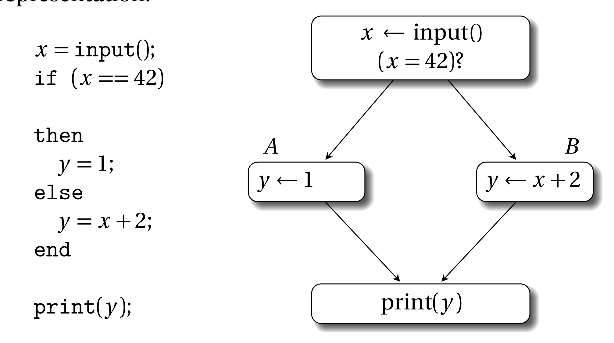
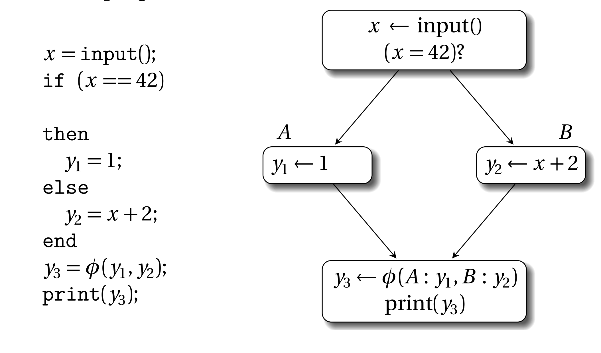
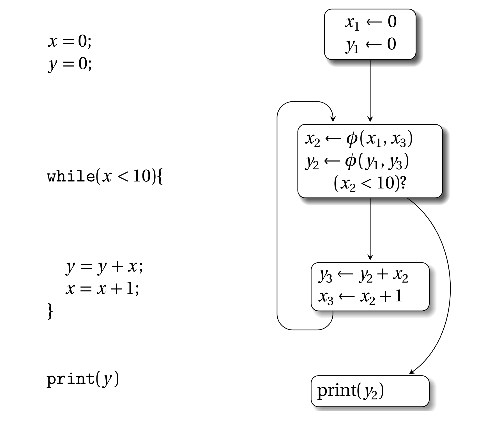
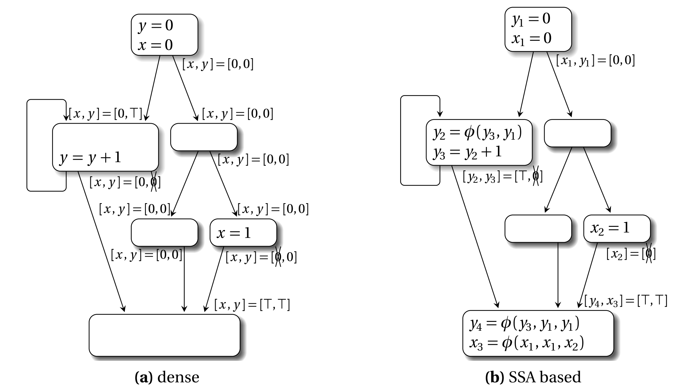

# 第一章 介绍

在日常编程中，名字是一个很有用的东西。这本书想传递的关键内容是对于每个不同的东西给它一个独一无二的名字可以消除很多不确定性以及不精确性。

举个例子，如果你无意中听到一段对话中有'Homer'这个词，没有上下文的情况下你不知道他说的是Homer Simpson（辛普森）还是古希腊诗人荷马还是你认识的某个叫Homer的人。但是只要你听到对话提及Springfield (辛普森一家）而不是Smyrna（希腊诗歌），你就能知道他们说的是辛普森一家这个电视剧。不过话又说回来，如果每个人都有一个独一无二的名字，那么就不可能混淆电视剧角色和古希腊文学人物，这个问题都不会成立。

这本书主要讨论静态单赋值（Static Single Assignment Form，SSA）形式，它是一种变量的命名约定。术语static说明SSA与属性和代码分析相关，术语single说明SSA强制变量名具有唯一性。术语assignment表示变量的定义。举个例子，在下面的代码中：
```
x = y + 1;
```
变量x被赋予表达式(y+1)的值。这是一个定义，或者对于x来说是赋值语句。编译器工程师会说上面的赋值语句将值(y+1)储存到左值x中。

## 1.1 SSA定义 
关于SSA最简单，限制最少的定义如下：

> "如果每个变量在程序中有且只有一个赋值语句，那么该程序是SSA形式"

但是实际上SSA还有很多变体，有更多的限制。这些变体可能使变量定义和使用与图论的一些特性有关，或者封装一些特定的控制流/数据流信息。每个SSA变体都有特设的性质。基本的SSA变体将会在第二章讨论，本书的第三部分还会讨论更多这部分的内容。

所有SSA变体，包括上面最简单的定义都有一个最基本属性就是引用透明性（referential transparency），所谓引用透明性是指程序中的每个变量只有一个定义，变量的值和它所在程序的位置无关。我们可能根据分支的条件完善对于某个变量的认识。举个例子，不用看代码我们就知道下面if语句后紧跟着的then/else条件块中x的值
```
if (x == 0)
```
因为x的值在这个if语句中是没有改变的。函数式编程语言写的程序是引用透明的，引用透明性对于形式化方法和数学推理很有用，因为表达式的值只依赖它的子表达式而不依赖求值的顺序或者表达式的副作用，或者其它表达式。对于一个引用透明的程序，考虑下面的代码片段：
```
x = 1;
y = x + 1;
x = 2;
z = x + 1;
```
一个naive（而且不正确）的分析器可能认为y和z的值相等，因为他们的定义是一样的，都是(x+1)，然而x的值取决于当前代码位置是在第二个赋值的前面还是后面，即变量的值取决于上下文。当编译器将这个代码段转换为SSA形式时，它会具有引用透明性。转换的过程会为一个变量的多次定义使用不同的名字（译注：x1和x2）。使用SSA形式后，只有当x1和x2相等时y和z才相等。
```
x1 = 1;
y = x1 + 1;
x2 = 2;
z = x2 + 1;
```

## 1.2 SSA的非形式化语义
在前一节中，我们看到了如何通过简单的重命名将代码转换为SSA形式。赋值语句左边被定义的变量叫做target，在SSA中，每个target都有唯一的名字。反过来，赋值语句右边可以多次使用target，在这里它们叫做source。贯穿本书，SSA的target名字定义都是变量名再加一个下标这种形式。一般来说这是不重要的实现细节，虽然它对于编译器debug来说很有用。

φ函数是SSA最重要的一个概念，它很特别，又叫做伪赋值函数（pseudo-assignment function）。有些人也叫它notational fiction。ɸ函数的用途是合并来自不同路径的值，一般出现在控制流的合并点。

考虑下面的代码示例和它对应的控制流图（Control Flow Graph，CFG）表示：



在if不同分支中，y有不同的定义。y的不同定义最终在print那个地方交汇。当编译器将该代码转换为SSA形式时，y的不同定义被命名为y1和y2。print既可以使用y1也可以使用y2，这取决于if的条件。在这种情况下，需要用φ函数引入新的变量y3，它的参数是y1和y2。因此SSA版本的上述程序如下：



就放置位置来说，φ函数一般是放到控制流交汇点，即CFG中有多个前驱基本块的那个基本块头部。如果有n条路径可以进入基本块b，那么在基本块b头部的φ函数有n个参数。φ函数会动态的选择正确的参数。φ函数根据n个参数，创建新的变量名，这个名字是唯一的，因为它要保证SSA的基本性质。因此，在上面的例子中，如果控制流从基本块A流向下面的基本块，那么y3使用φ函数选择y1作为它的值，反之φ函数使用y2作为它的值。注意CFG图φ函数的参数y1和y2前面还加了基本块的标签，这种形式是比较多余的，在本书的后面部分，这个基本块标签能不加就不加，除非没了它会引起歧义。

这里还要强调一下，如果基本块头部有多个φ函数，这些φ函数是并行的，即，它们是同时执行，不需要顺序执行。这一点是很重要的，因为在经过一些优化，比如复写传播（copy propagation）后φ函数的target可能是其它φ函数的source。在SSA解构阶段，φ函数会被消除（译注：就是编译器不需要SSA形式，想将它转换为其它IR，这就叫SSA解构），在解构阶段使用常规的复制操作序列化，这点会在17.6小结描述。这个小细节对于寄存器分配后的代码来说是相当重要的。

严格来说，φ函数不能被软件直接执行，因为进入φ函数的控制流没有被显式的编码进φ函数的参数。这是可以接受的，因为φ函数通常只用于程序的静态分析。然而，有很多扩展使得φ函数可以执行，如 φif 或者γ函数（参见第12章），它有一个额外的参数，告诉φ函数选择那个值。关于这个会在第12章，第16章和第18章讨论。

接下来我们再展示一个例子，它说明了一个循环控制流解构的SSA形式。下面是非SSA形式的程序和SSA形式的控制流图：


SSA代码在循环头部新增了两个φ函数。它们合并循环前的值定义和循环中的值的定义。

要注意不要混淆SSA和自动并行化优化中的（动态）静态赋值这两个概念。SSA不会阻止在程序执行的时候对一个变量的多次定义，比如，上面的SSA代码中，变量y3和x3在循环体内，每次循环都会重定义它们。

SSA构造的详细描述会在第3章给出，现在只需要明白下面的内容：

1. 如果程序的交汇点的某个变量有多个定义，那么会在交汇点插入φ函数
2. 整数下标用于重命名原来程序中的变量x和y

## 1.3 与传统数据流分析的比较
在未来的第11章我们会提到，SSA主要的一个优点是它对数据流分析（data-flow analysis）很友好。数据流分析在程序编译的时候收集信息，为未来的代码优化做准备。在程序运行时，这些信息会在变量间流动。静态分析通过在控制流图中传播这些信息，得以捕获关于数据流的一些事实（fact）。这种方式在传统的数据流分析中很常见。

通常，如果程序是一种功能性的（functional）或者稀疏（sparse）的表示，如SSA形式，那么数据流信息能程序中更高效的传播。当程序被转换为SSA形式时，变量在定义点被重命名。对于一个确凿的数据流问题，比如常量传播，它表现为一个程序点的集合，在这些程序点数据流事实可能改变。因此可以直接关联数据流事实和变量名字，而不是在每个程序点为所有变量维护各自的数据流事实的集合，下图展示了一个非零值分析（non-zero value analysis）


对于程序中的每个变量，分析的目标是静态确定哪些变量在运行时包含0值（即null）。在这里0就表示变量为null，0打一把叉表示不为null，T表示可能为null。上图(a)表示传统的数据流分析，我们会在六个基本块的入口点和出处都计算一次变量x和y信息。而在上图(b)的基于SSA的数据流分析中，我们只需要在变量定义处计算一下，然后就能获得六个数据流事实。

对于其它的数据流问题，属性也可能在变量定义之外发生改变，这些问题只要插入一些φ函数就能放入稀疏数据流分析的框架中，第11章会有一个例子讨论这个。总的来说，目前这个例子说明了SSA能给分析算法带来的关键好处是：

1. 数据流信息直接从定义语句处传播到使用它的地方，即通过def-use链，这个链条由SSA命名方式隐示给出。相反，传统的数据流分析需要将信息传遍整个程序，即便在很多地方这些信息都没改变，或者不相关。
2. 基于SSA的数据流分析更简洁。在示例中，比起传统方式，基于SSA的分析只有很少的数据流事实。

这本书的第二部分给出了一个完整的基于SSA数据流分析的描述。

## 1.4 此情此景此SSA
**历史背景**。在整个20世纪80年代，优化编译器技术越来越成熟，各种中间表示被提出，它们包含了数据依赖，使得数据流分析在这些中间表示上很容易进行。在这些中间表示背后的设计理念是显式/隐式包含变量定义和使用的关系，即def-use链条，使得数据流信息能有效的传播。程序依赖图（program dependence graph）和程序依赖网（program dependence web）均属此类IR。第12章还会讨论这些风格的IR的更多细节。

静态单赋值是由IBM Research开发的一种IR，并在20世纪80年代末的几篇研究论文中公开发表。SSA由于其符合直觉的性质和直观的构造算法得到了广泛的应用。SSA给出了一个标准化的变量def-use链，简化了很多数据流分析技术。

**当前状况**。当前主流的商业编译器和开源编译器，包括GCC，LLVM，HotSpot Java虚拟机，V8 JavaScript引擎都将SSA作为程序分析中的关键表示。由于在SSA执行优化速度快而且高效，那些即时编译器（JIT）会在一些高级地、与平台无关的表示（如Java字节码，CLI字节码，LLVM bitcode）上广泛使用SSA。
SSA最初是为了简化高级程序表示的变形而开发而创建的，因为其良好的特性，能够简化算法和减少计算复杂性。今天，SSA形式甚至被用于最后的代码生成阶段（见第四部分），即后端。好几个工业编译器和学术编译器，既有静态，也有just-in-time，都在它们的后端使用SSA，如LLVM，HotSpot，LAO，libFirm，Mono。很多使用SSA的编译器在编译快要结束时，即寄存器分配前才解构SSA。最近的研究甚至能在寄存器分配期间也使用SSA，SSA形式会保持到非常非常后面的机器代码生成过程才会被解构。

**SSA与高级语言**。到目前为止，我们展示了在低级代码上使用SSA形式做分析的优势。有趣的是，在高级代码上如果强制遵循某些准则也可能具有SSA的性质。根据SISAL语言的定义，程序自动具备引用透明性，因为变量不允许多次赋值。其它语言也能有SSA的性质，比如Java的变量加个final或者C#的变量加个const/readonly。

强制写出具有SSA性质的高级语言程序主要好处是这些程序能具备不变形，这简化了并发编程。猪肚的数据能在多个线程中自由的共享，没有任何数据依赖问题。数据依赖对于多核处理器来说是一个大问题。

在函数式编程语言中，引用透明是语言的基本特性。因此函数式编程隐式具有SSA性质。第6章会介绍SSA和函数式编程。

## 1.5 本书余章说明
本章引入了SSA的符号表示，本书的剩下部分就SSA的各个方面详细讨论。本书的终极目标是：

1. 清晰的描述SSA能为程序分析带来哪些好处
2. 消除那些阻止人们使用SSA的谬误

本节还剩下一些内容，它们与下一章的一些主题相关。

### 1.5.1 SSA的好处
SSA对于变量命名有严格要求，每个变量的名字都是独一无二的。赋值语言和控制流交汇点会引入新的变量名。这些简化了表达变量def-use关系的数据结构实现和变量存活范围。本书第二部分关注基于SSA的数据流恩熙，使用SSA主要有三个好处：

**编译时受益**。如果程序是SSA形式，很多编译器优化可以高效的进行，因为引用透明性意味着数据流信息直接与变量关联，而不是每个程序点的变量。关于这一点我们已经在1.3的非零值分析中演示过了。

**编译器开发受益**。SSA使得程序分析和转换能更容易表达。这意味着编译器工程师能更高产，可以写更多的pass，并且能debug更多的pass（译注：smile）。举个例子，基于SSA的GCC4.x的死代码优化比非GCC3.x的非SSA死代码优化实现总代码少了40%。

**程序运行时受益**。理论上，能基于SSA实现的分析和优化也能基于其它非SSA形式。前一点提到过，基于SSA的实现代码更少，因此很多基于SSA的编译器优化也能更高效进行，关于这一点的示例是一类控制流不敏感分析（control-flow insensitive analysis），具体参见论文[Using static single assignment form to improve flowinsensitive pointer analysis]()

### 1.5.2 SSA谬论
一些人认为SSA很复杂很繁琐，不能高效表达程序。这本书的目的就是让读者免去这些担忧。下面的表单展示了关于SSA常见的谬论，以及破除谬论的章节。
|   谬论   |  破除谬论    |   
| ---- | ---- | 
|   SSA让变量数爆炸   |  第二章会回顾SSA的主要变体，一些变体引入的变量数比原始SSA形式少很多    |  
| SSA的性质难以维持 | 第三章和第五章讨论了一些修复SSA性质的简单技术（因为一些优化可能重写中间表示，导致SSA性质被破坏）|
| SSA的性质难以维持 | 第三章和第十七章展示了高效且效果显著的SSA解构算法的复制操作 |
