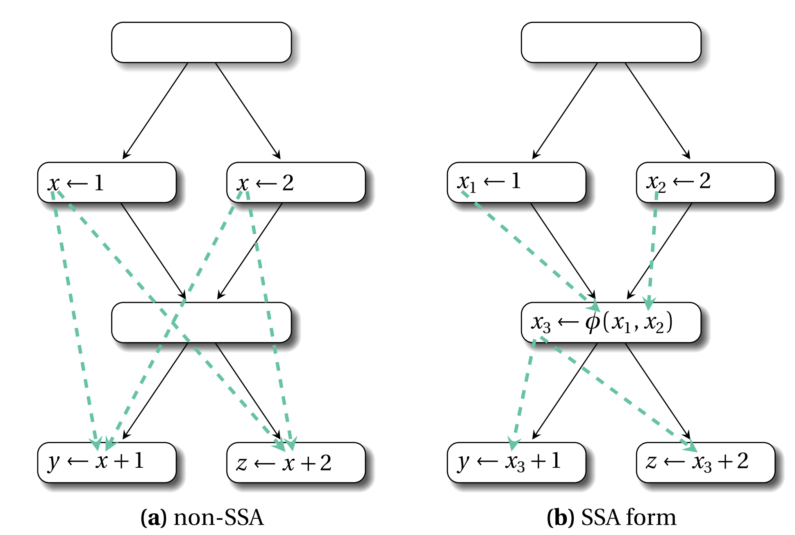
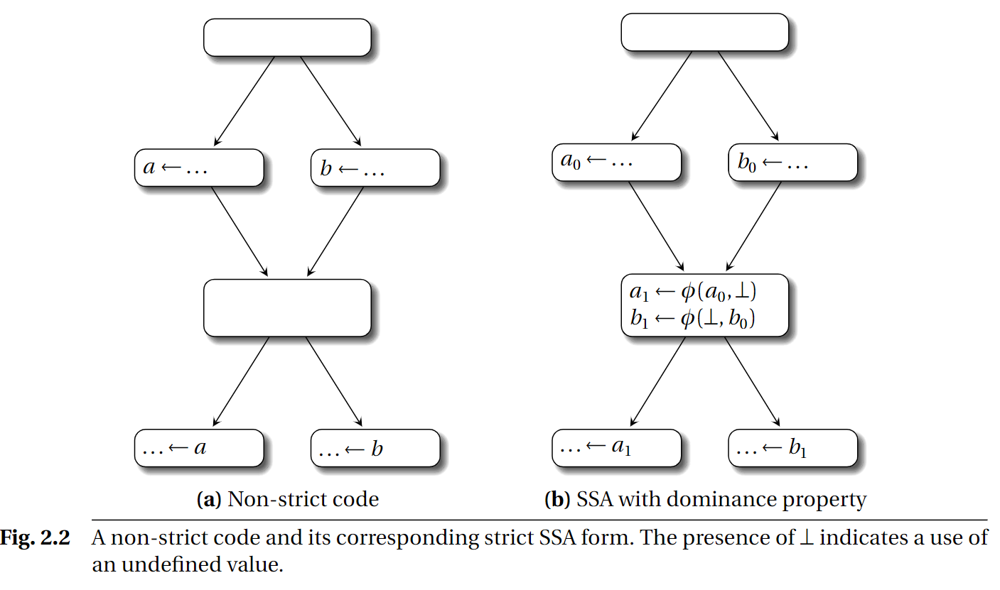

# 第二章 性质和变体
回忆第一章，如果每个变量只被定义一次，且每个用到这个变量的地方都是指向它的定义点，那么我们说该程序从属SSA形式。SSA有很多种变体和特色，它们都有考量。举个例子，不同形式的SSA就φ函数参数个数来说不尽相同。一些变体可能更难构造、维护和解构。本章将探索这些SSA变体，并讨论它们在某些确定的上下文中的优点。

## 2.1 Def-use和use-def链
SSA形式的每个变量只被定义一次。Def-use链是一种数据结构，它将变量的定义（def）和所有使用（use）这个变量的集合关联起来。反过来的use-def链是指能到达使用这个变量的所有定义。在本书后面我们会提到，def-use链对于前向数据流分析（forward data-flow analysis）很有用，因为它缩短了生成和使用数据流信息的程序点的距离。

因为每个变量仅定义一次的性质，SSA形式在很多方面简化了def-use和use-def链。**首先**，SSA形式尽可能早的组合信息。请看下图

非SSA形式的def-use需要很多次数据合并等，因为多次用到x，而基于SSA的def-use可以高效合并。

**其次**，因为关联变量和它的定义点很简单，所以use-def链的表达和维护几乎是无开销的。如果程序是SSA形式的，变量的use-def链自动存在，这些链构成链所谓的SSA图（见第12章）。显式包含use-def链简化了一些后向传播算法，比如死代码消除优化。

由于def-use是use-def的完全逆转体，基于它可以很容易的实现一些前向传播算法，维护这个只需要付出很小的努力。然而，就算没有def-use链，一些比较轻量级的前向传播算法如拷贝折叠也是可以实现的：使用单pass来沿着CFG的拓扑顺序遍历，大多数def都在use之前。当处理一个操作时，use-def链让我们可以从中间访问一个前面计算过的值。保守的合并动作仅发生在循环头的φ函数遇到没有处理的参数的时候。这样一个轻量级传播已经被证明是相当高效的。

## 2.2 最简性
SSA的构造包括两个阶段：重命名变量，放置φ函数。第一个阶段的目标是为了满足单个定义可达的性质，这一点早已提到过。最简性是φ插入后产生的一个额外属性，第三章会详细描述经典SSA构造算法，这一章我们主要描述SSA的最简性。

假设变量v的定义为D，程序点为p，在CFG中如果存在一条从D达到p的路径，且这条路径没有发生v的其它定义，那么我们称D到达（reach）程序点p。另外，当且仅当代码中的所有程序点的每个变量都只有一个定义可达，我们称这个程序具有单达到定义属性（single reaching-definition property）。在满足了单到达定义属性后，最简性意味着插入尽可能少的φ函数。

这个特性也可以用下面的join集合符号表达。令n1和n2表示两个不同的CFG的基本块，存在一个基本块n3，这里是否和n1和n2相同不重要，如果存在至少两个非空的路径n1到n3以及n2到n3（所谓非空是指至少包含一条CFG边），那么我们说n1和n2在n3处交汇，n3出现在两条路径中。换句话说，两条路径仅在n3交汇。令S表示基本块集合，如果S中至少两个基本块在n3交汇，那么n3 join这些基本块。S的join集用符号J(S)表达。

直觉上，join集对应φ函数。换句话说，如果n1和n2两个基本块都包含变量v的定义，那么我们应该在所有J({n1,n2})基本块里面放置φ函数。我们再规范一下这句话，如果Dv是包含v变量的基本块的集合，那么φ函数应该被放置在J(Dv)表示的所有基本块中。由于φ函数本身也算是def，所以在J(Dv U J(Dv))处我们可能还要插入些新的φ函数。事实证明J(S U J(S))=J(S)，所以join集合就表示应该在哪插入φ函数的最简集合。

目前我们不知道有任何优化严格要求最简性。然而只在join集放置φ函数可以很容易的使用第四章4.4中提到的拓扑遍历来完成，它是一个经典的技术。在后面我们还会提到使用它的一些原因。最后，正如未来会在第三章3.3针对可归约流图（reducible flow graph）中解释的那样，一些拷贝传播算法可以很容易的将非最简SSA转化为最简SSA。

## 2.3 严格SSA形式和支配属性
如果一个过程（procedure）中有多个变量，且变量所在的从入口到出口的每条路径中，总是先定义再使用，那么我们认为这个过程是**严格**的。有些编程语言，比如Java，强制施加**严格性**到语言中。一些其他的编程语言，比如C/C++，则没有这些限制。图2.2展示的是一个非严格的过程，因为存在一些路径上的变量不经过定义就使用。如果这些控制流路径在执行的时候被走到，那么会出现a未经赋值就使用。虽然这在某些情况下是允许的，但是通常这意味着程序错误或者糟糕的软件设计。

在SSA下，因为每个变量只有一个单独（single）的（静态（static））定义，严格性等同于支配属性（dominance property）。每个变量的use都被其def所支配。在CFG中，如果每条走到基本块n2的路径都包含基本块n1，那么基本块n1支配n2。按照习惯，我们约定CFG中的每个基本块都支配自身。如果n1支配n2，且n1≠n2，那么n1严格支配（strictly dominate）n2。我们使用符号`n1 dom n2`和`n1 sdom n2`来表示支配关系和严格支配关系。

在过程的入口点为每个变量都添加一个伪定义（undefined）可以保证严格性。前面讨论过，SSA所具有的单独的到达定值（reaching-definition）属性使得每个变量在程序的任意一处都只有一个def。如果程序某处U在使用变量v，那么v的到达定值D将会支配U，否则，一定存在一条路径使得从CFG入口到U可以不经过D。如果存在这样的路径，那么程序将不再是严格SSA形式（strict SSA form），并且必须在一些地方插入φ函数，在我们图2.2b的例子中，⊥就表示伪定义。这种形式的SSA也叫做最简SSA形式（minimal SSA form），它是SSA形式的一个变体，同时满足最简性和支配属性。在第三章我们应该会看到，最简SSA形式的构成方式就是为变量v放置φ函数。如果源过程是非严格的，那么将它转换成最简SSA将会创造出一个严格地、基于SSA的IR表示。这里严格性单独与SSA IR挂钩。如果输入程序本身就是非严格的，那么无论是转换成严格SSA形式或者从严格SSA形式转换都不能解决问题，因为始终存在未初始化就使用的变量。这里我们总结一下，在CFG入口添加伪定义以实现严格性不会影响程序的语义。

SSA with dominance property is useful for many reasons that directly origi-
nate from the structural properties of the variable live-ranges. The immediate
dominator??or “idom” of a node N is the unique node that strictly dominates
N but does not strictly dominate any other node that strictly dominates N . All
nodes but the entry node have immediate dominators. A dominator tree?is a
tree where the children of each node are those nodes it immediately dominates.
Because the immediate dominator is unique, it is a tree with the entry node as
root. For each variable, its live-range?, i.e., the set of program points where it is live,

is a sub-tree of the dominator tree. Among other consequences of this property,
we can cite the ability to design a fast and efficient method to query whether a
variable is live at point q or an iteration free algorithm to computes liveness sets
(see Chapter 9). This property also allows efficient algorithms to test whether
two variables interfere?(see Chapter 21): usually, we suppose that two variables
interfere if their live-ranges intersect (see Section 2.6 for further discussions
about this hypothesis). Note that in the general case, a variable is considered to
be live?at a program point if there exists a definition of that variable that can reach
this point (reaching definition analysis), and if there exists a definition-free path
to a use (upward-exposed use?analysis). For strict programs, any program point
from which you can reach a use without going through a definition is necessarily
reachable from a definition.

Another elegant consequence is that the intersection graph of live-ranges
belongs to a special class of graphs called chordal graphs?. Chordal graphs are
significant because several problems that are NP-complete on general graphs
have efficient linear-time solutions on chordal graphs, including graph color-
ing. Graph coloring plays an important role in register allocation?, as the register
assignment problem can be expressed as a coloring problem of the interfer-
ence graph?. In this graph, two variables are linked with an edge if they interfere,
meaning they cannot be assigned the same physical location (usually, a machine
register, or “color”). The underlying chordal property highly simplifies the assign-
ment problem otherwise considered NP-complete. In particular, a traversal of

the dominator tree, i.e., a “tree scan,”?can color all of the variables in the program,
without requiring the explicit construction of an interference graph. The tree
scan algorithm can be used for register allocation, which is discussed in greater
detail in Chapter 22.
As we have already mentioned, most φ-function placement algorithms are
based on the notion of dominance frontier (see Chapters 3 and 4) and conse-
quently do provide the dominance property. As we will see in Chapter 3, this
property can be broken by copy propagation: in our example of Figure 2.2b, the
argument a1 of the copy represented by a2 =φ(a1 , ⊥)can be propagated and
every occurrence of a2 can be safely replaced by a1 ; the now identity φ-function
can then be removed obtaining the initial code, that is still SSA but not strict
anymore. Making a non-strict SSA code strict is about the same complexity as
SSA construction (actually we need a pruned version as described below). Still
the “strictification” usually concerns only a few variables and a restricted region
of the CFG: the incremental update described in Chapter 5 will do the work with
less efforts
